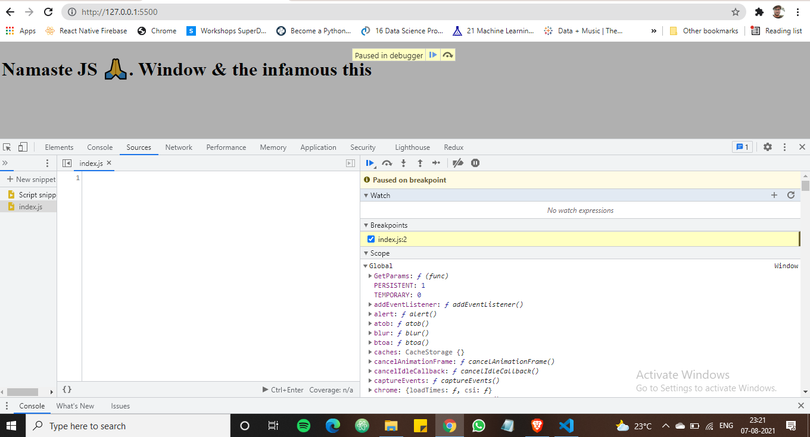
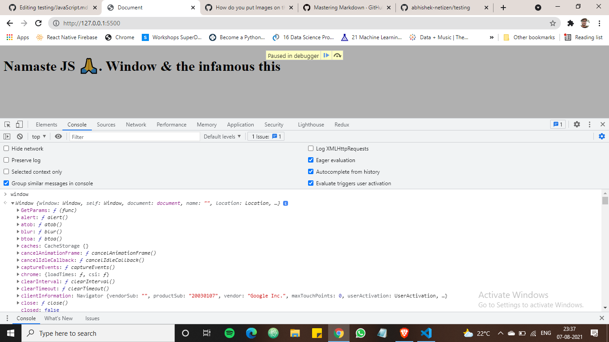

# Welcome to JavaScript.

# Day-1
## How JavaScript Works & Execution Context:
[Namaste JavaScript Ep.1](https://youtu.be/ZvbzSrg0afE) <br />
Everything in javascript happens inside a **Execution Context**: <br />
we can assume the 'Execution Context' as a big box or container in which whole JS code is executed. <br/>
'Execution Context' has two component, first one is ***memory component*** also known as **Variable Environment** <br />
and the second component is ***code component*** also called as **Thread of Execution**. <br /><br/>
**Variable Environment(memory component):-** this is the place in which all the variables and functions are stored in **key:value** pairs <br/>
**Thread of Excetion(code component):-** this is the place where code is executed one line at a time, thats where the words comes in > ***JavaScript is a Syncronous Single-Threaded Language***. <br/>
single threaded means it only executes one line at a time, syncronous single threaded means JS can only executes one line at a time in a specific order, it will only move to the next line only if the current line execution is finished.

[IMAGE YET TO COME]

Learn more about JS how does it works internally 👉 [JavaScript Internals](https://medium.com/@bdov_/javascript-typescript-execution-vs-lexical-vs-variable-environment-37ff3f264831) must read!!! tc of flaws in the article

# Day-2 
## How JavaScript Code is executed? & Call Stack:
[Namaste JavaScript Ep. 2](https://youtu.be/iLWTnMzWtj4) <br />

```
//Example code

var n = 2;
function square(num){
   var ans = num * num;
   return ans;
 }

var square2 = square(n);
const square4 = square(4);
```
Remember everything happens in javascript within ```Excecution Context```

when we run the above code <br/>
1. Global Excecution Context is created
2. It has two components **Memory component** & **Code component**
3. Excecution context done in two phase "Memory Creation phase" & "Code excecution phase"
4. in "Memory Creation" phase it will store all the variables as 'undefined', <br /> incase of function its literally stores entire func inside memory
5. So in first phase i.e "Memory Creation phase" folllowing things will happen, when JS starts from line by line from the top.
   **Memory** | **Code**
   -----------|---------
   n:undefined| 
   saquare:{entire func} | 
   square2:undefined |
   square4:undefined |
 6. So in second phase i.e "Code execution phase" code is actually started running(calulation & everything), when JS starts from line by line from the top, once again
 7. now when JS viewed 1st line it replaces undefined with actual value
     **Memory** | **Code**
     -----------|---------
      n:2| 
 8. in line 2 to 5 nothing to excecute, so its move to the line 6. <br/>
 Here the magic happens!!.  JS has to "envoke a function" <br/>
 9. When a function is Envoked it has to create another local ```Excecution Context``` <br/> thats exactly what happened here, when it encountered square(n) in line num 6
 10. so again memory and code and again phase 1 and phase 2
 11.  in phase 1
      **Memory local** | **Code local**
      -----------|---------
      num:undefined| 
      ans:undefined|
 12. in phase 2 code excecution start <br/>
```
var n = 2;
function square(num){  //argument
   var ans = num * num;
   return ans;
 }

var square2 = square(n); //parameter
var square4 = square(4);
```
1. parameter is passed to the function argument <br/> i.e 2
2. and the calcutn happens and its store the value in ans <br/>
   **Memory local** | **Code local**
   -----------|---------
    num: 2| 
    ans: 4|
 3. and then it encouters the ```return ans``` keyword <br/>
which literally tells the JS to ***Give back the control to the original excecution context,<br/>
where in which function is excecuted.*** in our case it is square(n)
4. so in 5TH Step (see above) it changes the value of square in Memory, and our ```local excecution context``` is done and deleted.
   **Memory** | **Code**
   -----------|---------
      n: 2| 
   square2: 4 |
5. ahh!! we done with till line var square(2), when JS move to line var square(4), <br/>it enokes a function i.e square(4) and passes the parameter i.e 4 to argument num
6. once again ```local excecution is created``` and do the calctn and updates local exceution context values, <br/> and when it encouters the ``return ans``
 it give back the control to global exceution where in which the function is envoked in our case it is square(4), <br/> and then it updates square4 variable value from undefined to 16
 
13. and finally our global excecution looks something like this 

**Memory** | **Code**
-----------|---------
n:2| 
square2:4 |
square4:16 |

Once JS finished all its work by excecuting all its line  then ```Global Excecution Context``` is also deleted uff!!

14. So now one more question arises, what if? if we have function invocation inside the function haha <br/>
then we have ```Global execution context ``` and we have ```local execution context``` inside another ```local execution context``` and so on.. <br/>
kind of nested local execution inside another local execution.

So how does JS manages all these contexts isn't that difficult to keep track of all those context ????


### Call Stack
It is a Stack : everytime in the bottom of the stack we have GEC or ```Global Excecution context``` <br/>
which means whenever a JS program is run    ```Global Excecution context``` is pushed to this call stack bottom. <br/>
and then when ```local execution context - E1``` is created or a function is envoked it is pushed on the top of the ```Global Excecution context``` <br/>
and when the E1 done with its job(in this case return ans) its popped out, and  the control goes to the GEC ```Global Excecution context``` where its left off in our case it is var square(2) <br/>
same goes with ```local execution context - E2``` .

***Call stack maintains the order of excecution of excecution contexts***


# Day-3
## Hoisting in JavaScript (variables & functions):
[Namaste JavaScript Ep. 3](https://youtu.be/Fnlnw8uY6jo) <br />
```
var x = 7;

function getName(){
console.log("Namaste JS")
}
getName();
console.log(x);
```
what is the output of above code ..?  <br/>
Namaste JS <br/>
7  ???  <br/>    Yep.


```
getName();
console.log(x);

var x = 7;

function getName(){
console.log("Namaste JS")
}

```
How about now ??? <br/> [REF1]
lemme guess what you are thinking <br/>
we are envoking a function before declaring it <br/>
and, we are accessing the x before initializing it <br/>
so output is ERROR!! ??<br/>
 <br/>
Wait... <br/>
you are thinking the same way as python thinking?? 😂, but It is => JavaScript guys. <br/>

lets see the output <br/>
```Namaste Javascript``` <br/>
``` Undefined ``` <br/>
but why is that ?? <br/>
why the function envoke printed Namaste JS and why console.log(x) printed Undefined ??  <br/>
ok lets make some small modification in the program <br/>

```
getName();
console.log(x);

//deleted here var x = 7;

function getName(){
console.log("Namaste JS")
}

```
So whats the ouput now ??? <br/>
its  <br/>
```Error!!``` <br/>
WTH why is that <br/>
Before its Undefined and now Error!!  why is that?? <br/>
Drag your  ```Day - 2 conecpts ``` from your global memory( i mean from your brain) <br/>
else refer the video mentioned in day 3 link from 6:10 <br/>

so what is **Hoisting** any way?? <br/>
Hoisting is a phenomenon in JS, where we can access the variables and functions even before initializing it. <br/>
that is the reason our prediction failed in the first phase [REF1()] <br/>

so now we understood whenever we try to run our program a ```Global Excecution GEC ``` is created and pused to the bottom of callstack <br/>
its created in two phase memory allocation and excecution phase <br/>
in memory allocation it reserve memory for all the variables and funxtions <br/>
for variable before excecution it will store undefined and for functions it will store complete functions <br/>
suppose if the function is envoked again it creates a ```Local execution context ``` and push on the top of GEC on callstack, <br/>
once its done control moves to GEC <br/>
same thing as ```Day2```

at last lets take a look at two type of functions syntax and its output by keeping Hoisting in mind <br/>

```
console.log(x)
getName()

var x = 7;

function getName(){
console.log("Namaste JS")
}
```
we already knew this output its undefined and a function itself<br/>

```
console.log(x)
getName()

var x = 7;

var getName = () => {
console.log("Namaste JS")
}
```
so what if the function is an arrow ?? <br/>
now the output became undefined and undefined <br/>
because we are storing the function to a variable <br/>
so the variables are treated as undefined by our ```Global excecution context``` <br/>

# Day-4
## How functions work in JS  & Variable Environment :
[Namaste JavaScript Ep. 4](https://youtu.be/gSDncyuGw0s) <br />

lets understand how this code works
```
1 var x = 1;
2 a()
3 b()
4 console.log(x)

5 function a(){
6  var x = 10;
7  console.log(x)
8  }

11 function b(){
12  var x = 100;
13  console.log(x)
14 }

```
what was the output of this function ? <br/>
10 <br/>
100 <br/>
1 <br/>  but why 10 100 then 1 ??? <br/>

1. before code execution our  ```Global execution context``` will start & pushed to the bottom of callstack<br/>
2. it allocates memory for variables and takes snapshot of functions bla bla <br/>
3. lets take a look at only code execution <br/>
4. initally we have x:undefined and we have code snapshots of  functions a() & b() <br/>
5. when it moves to line 2, it has to envoke a function a()
6. again ```local execution context ``` and pushed to callStack, initially x is undefined, <br/>
 but then it will looks x value inside the function a() only, Scope-man-Scope 😎 <br/>
7. and when func a() is done  ```local execution context ``` is pop off from the callStack, <br/>
and control moves to the GEC again, so now it moves to line 3 and envoke func b() <br/>
8. same procedure for func b() <br/>
9. when func b() is done the control moves to line 3 where it left off <br/>
10. when 4th line executes the console.log(x), it fetch from the local memory of GEC. Scope-man-Scope 😎 <br/>
11. when everything done, GEC is popped off, and we are done, and we can watch next video of NJS lol <br/>

# Day-5
## SHORTEST JS Program Window & this keyword :
[Namaste JavaScript Ep. 5](https://youtu.be/QCRpVw2KXf8) <br />
I think this is the video i enjoyed the most, till here <br/>
I always love 'this' even though i never understood how it works, what a pity!! <br/>
but now i think i got a little intro on it <br/>
so .... <br/>
lets begin. <br/>

what is the shortest program out-there ?? **its => JS** <br/>
lets test the above statement <br/>
create an empty folder open that on vscode <br/>
create a index.html and link our empty endex.js to it <br/>
then use vscode live server(click on icon on right side bottom of vscode or press f1) <br/>
now you are seeing your html linked to js on your default browser <br/>
open your dev tools  <br/>
go to source and click on index.js(the empty file, shortest program we ever knew of :) <br/>
lets add breaking point to the very first line of our empty index.js, and run the script by pressing ctrl+enter <br/>




now what we saw in the scope section ?,  we saw a **Global keyword**, but why ?? <br/>

lets discuss .. <br/>

1. eventhough its an empty file our JS engine does its job,  <br/>
and the job is creating a ```Global executing context ``` && allocating the memory to it, even though the index.js is empty <br/>
2. and also something interesting will happens here, JS engine will create something called as **Window** <br/>
3. Goto console and type window, you will get lot of objects created by JS engine. but what is it ??? <br/>

5. 
 


 

   

